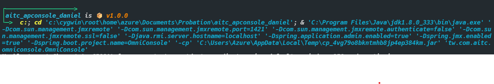
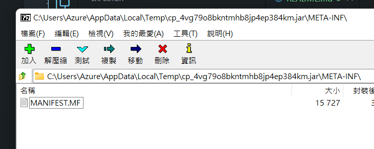
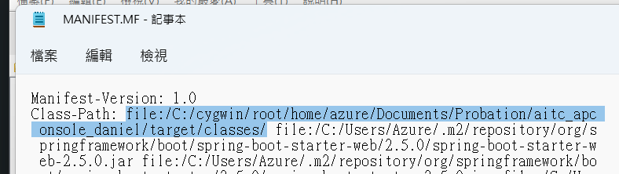

# 解決vscode透過Spring套件執行run時，靜態資源(網頁)找不到

## 問題在哪裡?
檢查RUN的時候vscode實際上執行了哪寫指令?這時會看到它實際是執行了<mark>某個/tmp/裡面的*.jar</mark>

## 執行了什麼?
用7zip去開啟它(jar檔其實是個壓縮檔)，打開後發現它竟然不是完整的專案!!?而且只有一個文件?打開看看寫了什麼。原來它是一個<mark>classpath的設定檔</mark>，可以看到它載入的資源有哪些?仔細去看位置，根本沒有網頁的檔案阿!!!

## 如何解決?
1. 把檔案複製一份到指定位置，使用vscode的spring套件。
2. 新增位置到MANIFEST.MF檔，但是這個方法要留意一個問題，/tmp/底下的jar檔，本身並沒有包含main的資訊，所以執行它的時候，要增加main的進入點(參考第一張圖的指令最後一句)